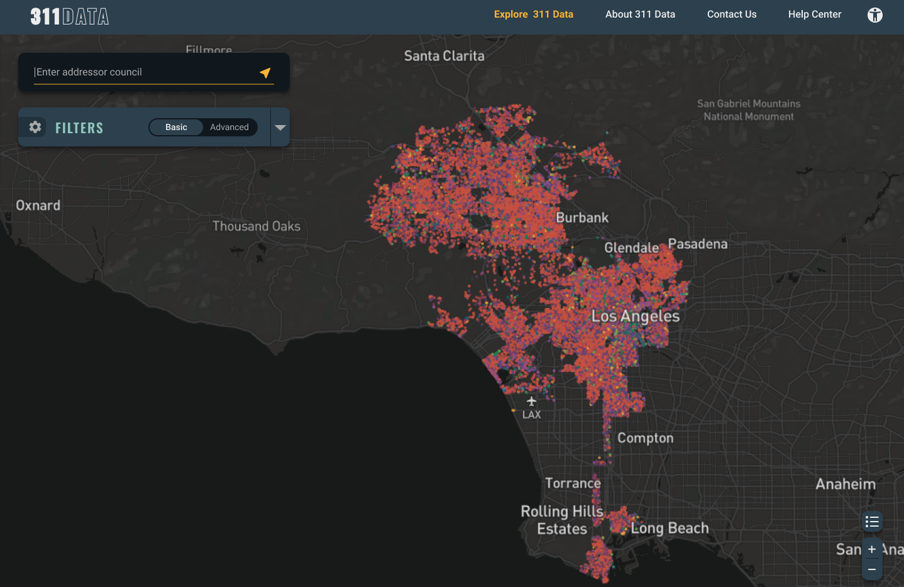

# The 311 Data project

Empowering Los Angeles neighborhood councils to analyze initiatives using data collected from the city 311 system.

## Project Technology

### Frontend

* Javascript (React)
* Redux
* Bulma
* HTML/CSS

[See here](client/README.md) for more information about 311 Data client technology.

### Server/API

* FastAPI: asynchronous Python REST API
* Redis: key-value caching
* PostgreSql: persistent SQL database
* Prefect: data ingestion pipeline in Python
* Docker: containerized servers hosted in AWS

[See here](server/README.md) for more information about 311 Data server technology.

### Data Analysis

* Python
* Pandas/Numpy/Matplotlib
* PostgreSql
* Socrata API

[See here](docs/data_loading.md) for more information about 311 Data project data analysis.

### UI/UX

* Figma
* Google Drive
* Adobe CC
* Miro

## Joining the 311 Data project

We are looking for volunteers!

311 Data is part of [Hack for LA](https://www.hackforla.org/) where you can sign up to join weekly onboarding meetings.

You can find more information about the current project team [here](https://www.hackforla.org/projects/311-data).

### To Sign Up

* Go to the [Getting Started](https://www.hackforla.org/getting-started) page on the Hack for LA website and learn about the projects and onboarding process.
* Sign up for an onboarding session on the [Hack for LA Meetup](https://www.meetup.com/hackforla/events) page. These session happen every week!

## More Information about the 311 Data project

* [Background resources](docs/background.md)
* [Contributing to the project](docs/contributing.md)
* [Data loading and analysis](docs/data_loading.md)
* [Server setup](docs/server_setup.md)
* [Upgrades](docs/upgrades.md)
