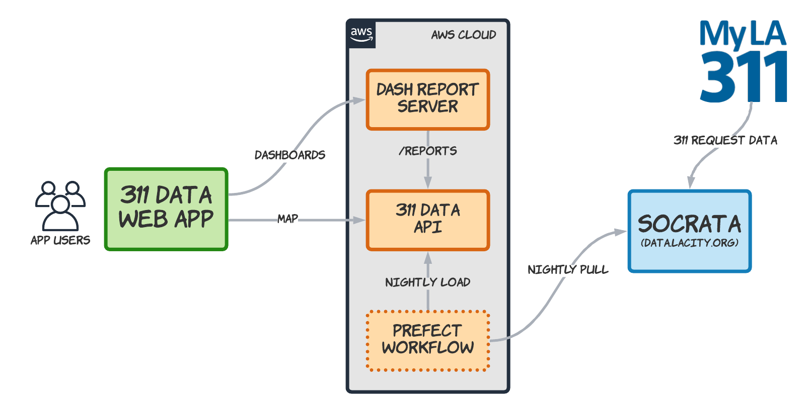

# Data Loading

Data is pulled nightly from the [LA Open Data](https://data.lacity.org/) website using a [Prefect](https://www.prefect.io/) workflow. The workflow loads new records and updates any that have been modified. Prefect tasks then update the API cache and reloads the dashboards.

## Notes about how we handle the 311 Data

The data we load essentially comes from a single data source of 311 requests (technically, it's broken up by calendar year) and a GeoJSON file for Neighborhood councils.

1. Data for service requests are **loaded with very little transformation**. Preparation for reporting is mostly done by joining with cleaned dimensions.
2. The key dimensions are: council (nc), type (requesttype), agency (owner), source (requestsource). Councils are further grouped into regions.
3. **Not all requests are associated with a neighborhood council**. There are some areas such as Pacific Palisades, Brentwood, and parts of South LA that are not covered by councils. We associate these requests with a "council" with an ID of 0.
4. These "no-council" requests will appear in some reports and therefore some totals may not add up; I.E., there will always be more requests at the city-wide level than the sum of the councils.
5. **We only use requests that have a valid latitude and longitude** (this is more than 99% of the data). Some Feedback requests are pure commentary and have no location so they do not appear in reports. However, there are some Feedback requests that are either associated with other requests or are requests on their own (should probably be categorized as Other) which are included.
6. There is some conflict in the data between dates and statuses. There are also some quality problems with dates (e.g. closed is before created, dates in the future). To keep things simple **a request is considered 'closed' if there is a closeddate and 'open' otherwise**. Also, we enforce a rule that requests take a minimum of 0 days to close.
7. The Report Water Waste request type is currently being ignored.

Details on the data are below.

## LA Open Data Format

The service request data from the LA Open Data system is divided up into different data source for each year but they all follow essentially the same format.

A sample data source is here and includes the data dictionary:
https://data.lacity.org/A-Well-Run-City/MyLA311-Service-Request-Data-2020/rq3b-xjk8

Fields that are pulled into the 311 Data system a listed below.

## 311 REQUEST FIELDS

(Note: counts below are as of late 2020)

### id (PRIMARY KEY)

    Auto-Generated by 311 Data Server

### srnumber (character)

    Source (Socrata) system identifier

### requesttype (character)

    Bulky Items 1205139
    Dead Animal Removal 46827
    Electronic Waste    80539
    Feedback    1132
    Graffiti Removal    610139
    Homeless Encampment 99843
    Illegal Dumping Pickup  234852
    Metal/Household Appliances  221303
    Multiple Streetlight Issue  13595
    Other   36863
    Report Water Waste  2083
    Single Streetlight Issue    19938

### status (character)

    Cancelled   89987
    Closed  2450076
    Forward 209
    Open    17290
    Pending 13748
    Referred Out    943

    Open - Being reviewed and worked on. 
    Pending - Has been reviewed and requires additional work Forward - Has been reviewed and forwarded to another department for fulfillment. 
    Closed - The request has been completed. 
    Canceled - The request could not be completed. 
    Referred Out - The request was referred out to an outside agency and the request can no longer be tracked in MyLA311

### actiontaken (character)

    Consultation/3-way  6
    Escalate to Supervisor  71
    Information Provided    47
    Referred to Other Agency    5
    SR Created  2571622
    SR Updated  334
    Status Provided 2
    Transferred 161
    Unable to Assist    5

### createddate (datetime)

### updateddate (datetime)

### servicedate (datetime)

### closeddate (datetime)

### requestsource (character)

    Call    1183518
    City Attorney   7
    Council's Office    2246
    Driver Self Report  401814
    Email   7126
    Fax 28
    Letter  5
    Mayor's Office  31
    Mobile App  641933
    Queue Initiated Customer Call   20
    Radio   2
    Self Service    334379
    TTY/ NexTalk    3
    Twitter 459
    Voicemail   564
    Walk-in 91
    Web Form    27

### anonymous (character)

    (unused)

### mobileos (character)

    (unused)

### owner (character)

    (unused)

### nc (integer)

    Neighborhood council district identifier

### ncname (character)

    (unused)

### policeprecinct (character)

    (unused)

### apc (character)

    (unused)

### assignto (character)

    (unused)

### cd (integer)

    City council district identifier

### cdmember (character)

    (unused)

### address (character)

### zipcode (character)

### latitude (double)

### longitude (double)

## Other Open Data sources

While the 311 data sources are the primary ones, we also load geographic data for the councils. Demographic and safety data are also available.

* [Neighborhood Geographic data](https://geohub.lacity.org/datasets/neighborhood-council-boundaries-2018/data?geometry=-121.842%2C33.513%2C-115.019%2C35.101)
* [Neighborhood Demographic data](https://geohub.lacity.org/datasets/demographics-of-neighborhood-councils?geometry=-118.566%2C34.016%2C-118.140%2C34.116)
* [Citywide Crime data](https://data.lacity.org/Public-Safety/Crime-Data-from-2020-to-Present/2nrs-mtv8)
