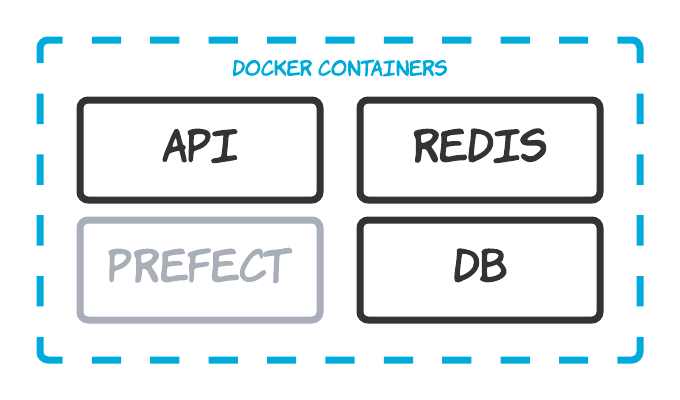

# Setting up a local 311 Data Server

The easiest way to get up and running with the 311 API is to build and deploy it locally using Docker.

*Prerequisite:* Docker is the only required dependency for running the server. You can find installation instructions [here](https://docs.docker.com/compose/install/).



## Step 1: Install the project and Docker containers

Download the project from GitHub and build the Docker containers.

```bash
git clone https://github.com/hackforla/311-data.git    # get the project
cd 311-data/server                                     # go to the server directory
cp .env.example .env                                   # make loacl copy of the ENV file
docker-compose up                                      # build and start the containers
```

Running ```docker container ls``` should now show 4 containers:

1. db: a Postgres database
2. redis: a redis cache
3. api: the 311 Data API
4. prefect: the data loading tool

## Step 3: Build and seed your local database

The database is built with alembic running on the API container.

```bash
docker-compose run api alembic upgrade head    # this will run the API container and build the database
```

The easiest way to seed your local database is using the Prefect container. The prefect flow typically will add new records since the last time it was run, but in this example you'll use it to seed 2 complete years of data.

First uncomment the following 2 lines in your ```.env``` file.

```bash
# PREFECT__MODE=full                # specify a full load (as opposed to an update load)
# PREFECT__DATA__YEARS=2020,2019    # a comma-separated list of data years to load
```

Then run the prefect container manually.

```bash
docker-compose run prefect python flow.py    # this will run the container using the .env file settings
```

The Prefect data loading task will run in interactive mode printing out status information as it goes. After a few minutes the task should complete with a message similar to the following:

```bash
"Loading Socrata data to Postgres" loaded [2,560,585] records, updated [0] records, and finished with message "All reference tasks succeeded."
```

## Step 3: Browse the API documentation

The OpenAPI documentation will appear here: http://localhost:5000/docs

```bash
curl -X GET "http://localhost:5000/status/api"      # will show the API version
curl -X GET "http://localhost:5000/status/cache"    # will show stats for the redis cache
curl -X GET "http://localhost:5000/status/db"       # will show the number of records loaded to key tables
curl -X GET "http://localhost:5000/status/log"      # will show results from the prefect data loading task
```

You can additionally run the ReactJS app with ```npm start``` from /client to make sure front-end works
