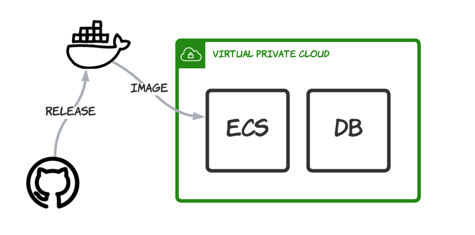

# API Releases and Data Migrations

This document is a quick introduction to how upgrades of the API are made.



## Standard upgrades

New code is packaged by a GitHub action and deployed to Docker Hub as a public image. Then an AWS API call is made to force the cluster to recycle and pull down the new image ```aws ecs update-service```.

## Data Migrations

Some upgrades include changes to the database schema and/or new data to be seeded to the database. In these cases, an upgrade script is executed using alembic. Alembic and the upgrade scripts are included on the API Docker image and needs to be run manually.

The way to manually run a task in ECS:

- Go to the task definitions in AWS and choose the task definition (e.g. dev-la-311-data-server)
- Select 'Run Task' from the Actions menu
- Choose the cluster you want to run on (dev or prod)
- Need to match the subnets and security groups of the scheduled tasks
- Need to enable a public IP address (docker needs to hit docker hub to check for new images)
- The API image command needs to be overridden with ```alembic,upgrade,head```

Tasks will appear in the cluster and will be logged in CloudWatch.
