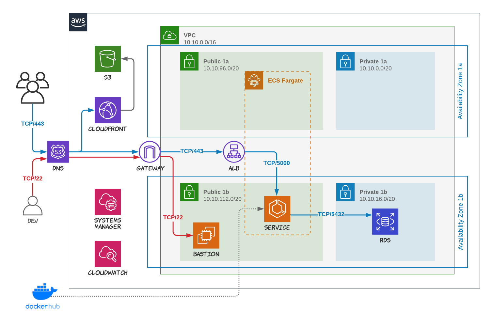

# 311 Data Terraform Blueprint

This Terraform blueprint manages the infrastructure needed to run the 311 Data API project in AWS.

- creates the complete network infrastructure including the VPC, subnets, gateway, network ACLs, and security groups across 2 availability zones
- creates the Postgres RDS instance with the database and credentials (which are stored in a SSM parameter)
- creates the ECS cluster, service and the load balancer

Note that this blueprint only handles the server infrastructure. The client application needs to be provisioned separately (DNS, S3 bucket and CloudFront).

## Diagram



## Assumptions

- AWS account is already created
- A task-definition.json is already loaded to the AWS account
- IAM Role (ecsTaskExecutionRole) already created with SSMReadOnlyAccess AND ECSTaskExecutionRolePolicy applied
- SSL/TLS certificate is already created and loaded to the AWS account
- DNS is manually pointed to the ALB once the deployment is complete

## Deployment

The blueprint is meant to be deployed manually. The person deploying the blueprint will have the AWS CLI installed and a profile with Admin access for the AWS account being used. Use the Terraform commands (init, plan, apply, etc.) to configure the 0.12 version environment and deploy the environment.

### Parameters

The following parameters (at minimum) need to be set in order to run the blueprint. You can use, for example, a .tfvars file for these.

- profile
- account_id
- db_name
- db_username
- db_password
- acm_certificate_arn

### Secrets Stored in SSM

Secrets are injected into the ECS containers as environment variables at runtime. The secrets are stored as AWS Systems Manager (AWS SSM) parameters in the format ```/[environment]/[region]/[secret_name]```.

For example, the value from ```/dev/us-east-1/DB_DSN``` will be injected as the database connection string into the application.

## After the Deployment

The environment will be created with a blank database. As a result the application will initially show an error message. The initial Alembic migration needs to be run then the database populated using the Prefect data pipeline.

The easiest way to do this is with a SSH tunnel to the database using the Bastion server.

### Developer Access with SSH and Bastion Server

The network infrastructure is hardened but allows developers to support the application using SSH to connect to a Bastion server.

Developers provide public SSH keys which are then added to a ```public_keys``` folder in the directory from where you are applying this terraform configuration.

Developers can then set up port forwarding to the database through the bastion by running a SSH command like the following.

```bash
ssh -i ~/.ssh/[YOUR SSH KEY] -L 5432:[DB URL]:5432 [EC2 USER]@[BASTION IP]
```

There are database clients such as [Postico](https://eggerapps.at/postico/) which have good support for using SSH tunnels to connect to a database.

GitHub has a [good guide](https://docs.github.com/en/free-pro-team@latest/github/authenticating-to-github/connecting-to-github-with-ssh) for creating a SSH key for yourself if you've never done it before. It's a good idea to create a new key for HackforLA projects and name it accordingly (e.g. "yourname_H4LA").
